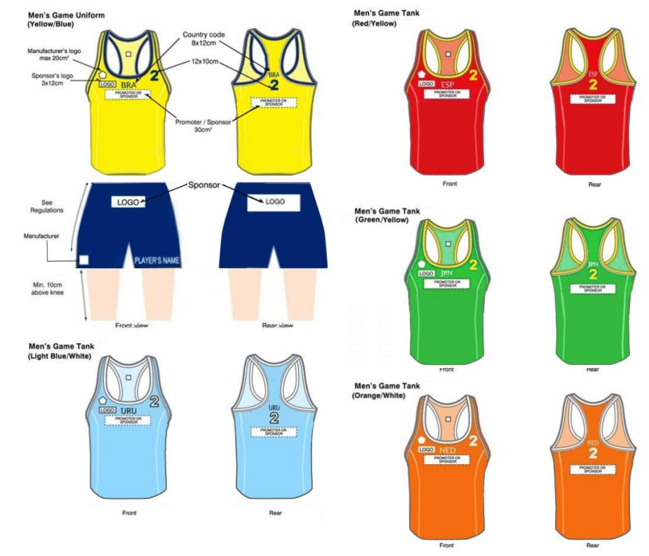
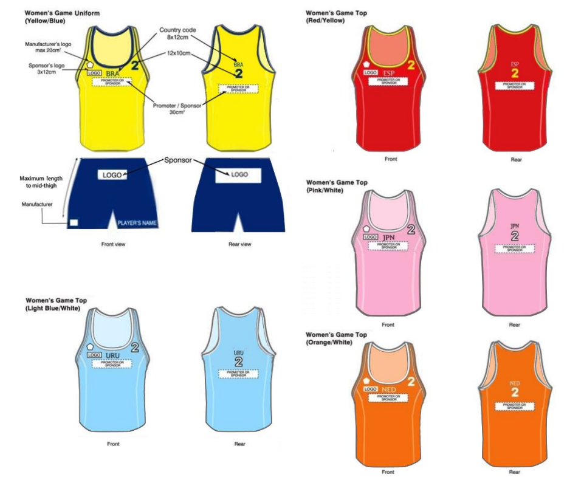

# Athlete Uniform Regulations

Athletes’ uniforms and accessories contribute to helping athletes increase
their performance as well as remain coherent with the sportive and
attractive image of the sport.

This part of the rules provides all the details concerning uniform and
accessory specifications with regards to colour, style, quantity, fabric and
brandings, which all teams and organizers are expected to utilize.

The Competition Management (CM) must check each participating team’s
athletic uniforms during the Technical Meeting (TM) and during the event.
All men’s and women’s athletic uniforms must correspond to the standards
indicated hereunder. According to the Olympic Charter, religious, political
and racial messages are strictly forbidden on athletic uniforms.

### Men’s tank top / Women’s body fit tank top style
The style of the tank tops / body fit tank tops must be in accordance with the graphics shown below. The men’s tank tops and the women’s body fit tank tops must be sleeveless and close fitting, and respect the space for the required brandings. T-shirts that are worn under the team’s official tank top are not allowed.

#### Color
Tank tops / body fit tank tops will be of bright and light colours (i.e. red, blue, yellow,
green, orange and white) in the attempt to reflect the colours usually
used and worn on the beach.

#### Brandings
- Promoter’s / sponsor logos:

   The promoter’s/sponsor logos can be printed on the front and back
of the men’s tank tops and the women’s body fit tank 
tops.
- Manufacturer’s logo:

   The manufacturer’s logo is printed on the front of the tank tops / body fit tank tops and must not exceed 20 cm2.

#### Athlete’s number
The athlete’s number (of approx. 12x10 centimetres) must be placed on the front and back of the men’s tank tops and the women’s body fit tank tops. This information must be printed in a contrasting colour to that of the tank top / body fit tank top (i.e. light on a dark tank top / body fit tank top, dark on a light tank top / body fit tank top).

### Men’s and women's shorts style
Team members must wear identical shorts. Male athletes
must wear shorts as per the graphics below. The players’ shorts, if not too
baggy, can be longer but **must remain 10 centimetres above the
kneecap**. Female athletes must wear short tight pants with a close fit that are in accordance with the
graphics.

Teams are authorized to have sponsor logos (including manufacturer) on
their shorts, located in any position and of any size.

There is no limitation in the number of the sponsors to be displayed on the
shorts. Athletes are required to print their name and nickname on
their shorts.

The respective team officials must submit their own team’s uniforms for approval during the pre-competition technical meeting.

### Uniform for cold weather
During severe weather conditions, players will be allowed to use
uniforms composed of tight shirt, long tight pants (down to the ankle
and not to the knees). These must be consistent in style and colour
following the same marketing rules as for the players’ shorts and briefs,
regardless of size and position. The CM will be ultimately responsible
to allow players to wear such a special uniform whenever will be
required, after having consulted with the official medical staff.

For the cold weather tank tops / body fit tank tops, sponsor logos are allowed for both men and women. For cold weather pants,
sponsor logos are allowed both for men and women according to the general
ruling, as stated above.

### Men's Uniform

### Women's Uniform

