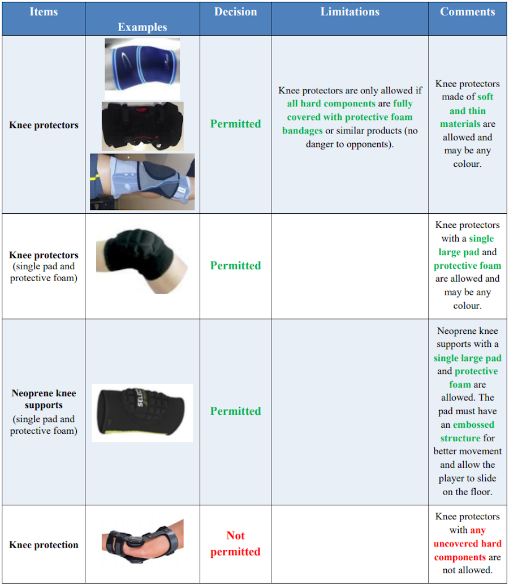
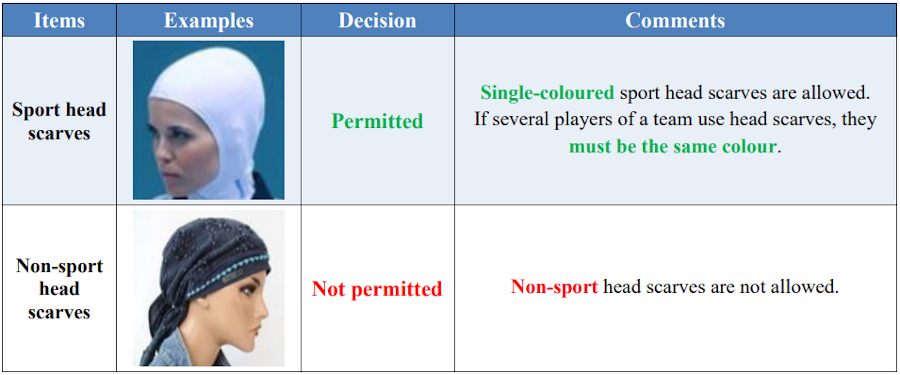
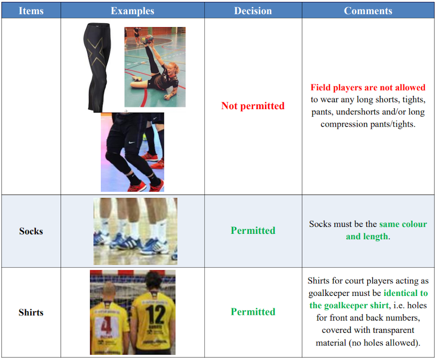

# Ausrüstungsreglement

Edition: Juli 2017

*Source: https://www.ihf.info/sites/default/files/2019-07/0_Regulations%20on%20Protective%20Equipment%20and%20Accessories_ALL.pdf*

## 1. Kopf- und Gesichtsschutz

|Objekt     |Beispiele                                               |Entscheidung |Einschränkung|Bemerkung                 |
|-----------|--------------------------------------------------------|-------------|-------------|--------------------------|
|Masken     |     |Nicht erlaubt|             |Masken sind nicht erlaubt.|
|Helme      |    |Nicht erlaubt|             |Helme sind nicht erlaubt. |
|Nasenschutz||Erlaubt      |Erlaubt sind nur weiche, einfarbige Materialien und Tapes.||

## 2. Stirnbänder

|Beispiele                                                                                                                    |Entscheidung |Einschränkung|Bemerkung                |
|-----------------------------------------------------------------------------------------------------------------------------|-------------|-------------|-------------------------|
| |Erlaubt      |Stirnbänder müssen elastisch, dünn und schmal sein.||
| |Nicht erlaubt|             |Nicht erlaubt sind Stirnbänder, die nicht elastisch, nicht dünn genug und/oder zu breit sind.|

## 3. Schutzbrillen

|Beispiele                                                                                                                                                                                      |Entscheidung |Bemerkung                |
|-----------------------------------------------------------------------------------------------------------------------------------------------------------------------------------------------|-------------|-------------------------|
|  |Erlaubt      |Sport- und Schutzbrillen mit speziellen Sportbändern, stabilen Kunststofflinsen und Bügeln aus Silikon oder anderen elastischen Materialien sind erlaubt.|
|                                                                                                                                |Nicht erlaubt|Sport- und Schutzbrillen mit starren Bügeln sind nicht erlaubt.|

## 4. Mundschutz

|Beispiele                                                                                                            |Entscheidung |Bemerkung                |
|---------------------------------------------------------------------------------------------------------------------|-------------|-------------------------|
|                                                           |Erlaubt      |Transparenter und einfarbiger Mundschutz ist erlaubt.|
| |Nicht erlaubt|Nicht transparenter und/oder mehrfarbiger Mundschutz ist nicht erlaubt.|

## 5. Schulterschutz und Kompressionsbandagen

## 6. Ellbogenschutz

## 7. Knieschutz

## 8. Kompressionsstutzen

## 9. Sprunggelenkschutz

## 10. Kleidung

***Zusammenfassung:***

- Lange Hosen sind nicht erlaubt (Ausnahme: Torwart).

- Die Kombination aus Unterziehhose, Knieschützer, Kompressionsstutzen und Socken ist nur erlaubt, wenn es sich dabei um vier separate Teile handelt.

- Die Farbe von Kompressionsbandagen und langärmligen Unterziehhemden muss der Hauptfarbe des Trikots entsprechen.

- Die Farbe von Unterziehhosen muss der Hauptfarbe der Hose entsprechen.

- Die Farbe von Kompressionsstutzen muss der Farbe der Socken entsprechen.

- Die Farbe von Sprunggelenkprotektoren muss der Farbe der Socken entsprechen.

- Ellbogen- und Knieschützer sind in beliebigen Farben erlaubt.

## 11. Besondere Ausrüstungsgegenstände

